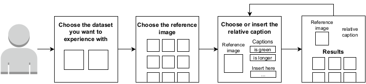

# CLIP4CirDemo
### CLIP for Conditioned image retrieval Demo

**Live Demo available [here](http://cir.micc.unifi.it:5000/)**

**Training code available at [](https://github.com/ABaldrati/CLIP4Cir)**


* [**Demo paper**](https://openaccess.thecvf.com/content/CVPR2022/papers/Baldrati_Effective_Conditioned_and_Composed_Image_Retrieval_Combining_CLIP-Based_Features_CVPR_2022_paper.pdf) at [CVPR 2022](https://cvpr2022.thecvf.com)\
[](https://paperswithcode.com/sota/image-retrieval-on-fashion-iq?p=effective-conditioned-and-composed-image)
[](https://paperswithcode.com/sota/image-retrieval-on-cirr?p=effective-conditioned-and-composed-image)


* [**Follow-up paper**](https://openaccess.thecvf.com/content/CVPR2022W/ODRUM/papers/Baldrati_Conditioned_and_Composed_Image_Retrieval_Combining_and_Partially_Fine-Tuning_CLIP-Based_CVPRW_2022_paper.pdf) presented at [CVPR 2022](https://cvpr2022.thecvf.com) workshop [O-DRUM](https://asu-apg.github.io/odrum/)\
[](https://paperswithcode.com/sota/image-retrieval-on-fashion-iq?p=conditioned-and-composed-image-retrieval)
[](https://paperswithcode.com/sota/image-retrieval-on-cirr?p=conditioned-and-composed-image-retrieval)

## Table of Contents


* [About the Project](#about-the-project)
  * [Built With](#built-with)
* [Getting Started](#getting-started)
  * [Prerequisites](#prerequisites)
  * [Installation](#installation)
* [Usage](#usage)
  * [Data Preparation](#data-preparation)
  * [Feature Extraction](#feature-extraction)
  * [Run the Demo](#run-the-demo)
* [Demo Overview](#demo-overview)
* [Authors](#authors)
* [Citation](#citation)

## About The Project



This is the **official repository** of the paper [**Effective conditioned and composed image retrieval combining CLIP-based features**](https://openaccess.thecvf.com/content/CVPR2022/papers/Baldrati_Effective_Conditioned_and_Composed_Image_Retrieval_Combining_CLIP-Based_Features_CVPR_2022_paper.pdf) accepted for the [Demo Track](https://cvpr2022.thecvf.com/call-demos) at [CVPR 2022](https://cvpr2022.thecvf.com).

If you are interested in Conditioned and Composed image retrieval take a look at our follow-up work [**Conditioned and composed image retrieval
combining and partially fine-tuning CLIP-based features**](https://openaccess.thecvf.com/content/CVPR2022W/ODRUM/papers/Baldrati_Conditioned_and_Composed_Image_Retrieval_Combining_and_Partially_Fine-Tuning_CLIP-Based_CVPRW_2022_paper.pdf) accepted at [CVPR 2022](https://cvpr2022.thecvf.com) workshop [O-DRUM](https://asu-apg.github.io/odrum/)

Conditioned and composed image retrieval extend CBIR systems by combining a query image with an additional text that 
expresses the intent of the user, describing additional requests w.r.t. the visual content of the query image.
This type of search is interesting for e-commerce applications, e.g. to develop interactive multimodal searches and chatbots.

In this demo, we present an interactive system based on a combiner network, trained using contrastive learning, that 
combines visual and textual features obtained from the OpenAI CLIP network to address conditioned CBIR. The system can
be used to improve e-shop search engines. For example, considering the fashion domain it lets users search for dresses, 
shirts and toptees using a candidate start image and expressing some visual differences w.r.t. its visual content, e.g. 
asking to change color, pattern or shape. 

The proposed network obtains state-of-the-art performance on the FashionIQ dataset and on the more recent CIRR dataset, 
showing its applicability to the fashion domain for conditioned retrieval, and to more generic content considering the 
more general task of composed image retrieval.

### Built With
* [Python](https://www.python.org/)
* [PyTorch](https://pytorch.org/)
* [Torchvision](https://pytorch.org/vision/stable/index.html)
* [CLIP](https://github.com/openai/CLIP)
* [Flask](https://flask.palletsprojects.com/en/2.0.x/)
* [Bootstrap](https://getbootstrap.com/)


## Getting Started

To get a local copy up and running follow these simple steps.

### Prerequisites

We strongly recommend the use of the [**Anaconda**](https://www.anaconda.com/) package manager in order to avoid dependency/reproducibility problems.
A conda installation guide for linux systems can be found [here](https://docs.conda.io/projects/conda/en/latest/user-guide/install/linux.html)

### Installation
 
1. Clone the repo
```sh
git clone https://github.com/ABaldrati/CLIP4CirDemo
```
2. Install Python dependencies
```sh
conda create -n clip4cir -y python=3.8
conda activate clip4cir
conda install -y -c pytorch pytorch=1.7.1 torchvision=0.8.2
pip install flask==2.0.2
pip install git+https://github.com/openai/CLIP.git
```
3. Download [**FashionIQ**](https://sites.google.com/view/cvcreative2020/fashion-iq)
and [**CIRR**](https://cuberick-orion.github.io/CIRR/) datasets
## Usage
Here's a brief description of each and every file and folder in the repo:

* ```utils.py```: Utils file
* ```model.py```: Combiner model definition file
* ```data_utils.py```: Dataset loading and preprocessing utils file
* ```extract_features.py```: Feature extraction file
* ```hubconf.py```: Torch Hub config file
* ```app.py```: Flask server file
* ```static```: Flask static files folder
* ```templates```: Flask templates folder

### Data Preparation
To properly work with the codebase [**FashionIQ**](https://sites.google.com/view/cvcreative2020/fashion-iq)
and [**CIRR**](https://cuberick-orion.github.io/CIRR/) datasets should have the following structure:


```
project_base_path
└───  fashionIQ_dataset
      └─── captions
            | cap.dress.test.json
            | cap.dress.train.json
            | cap.dress.val.json
            | ...
            
      └───  images
            | B00006M009.jpg
            | B00006M00B.jpg
            | B00006M6IH.jpg
            | ...
            
      └─── image_splits
            | split.dress.test.json
            | split.dress.train.json
            | split.dress.val.json
            | ...

└───  cirr_dataset       
       └─── dev
            | dev-0-0-img0.png
            | dev-0-0-img1.png
            | dev-0-1-img0.png
            | ...
       
       └─── test1
            | test1-0-0-img0.png
            | test1-0-0-img1.png
            | test1-0-1-img0.png 
            | ...
       
       └─── cirr
            └─── captions
                | cap.rc2.test1.json
                | cap.rc2.train.json
                | cap.rc2.val.json
                
            └─── image_splits
                | split.rc2.test1.json
                | split.rc2.train.json
                | split.rc2.val.json
```

### Feature Extraction
Before launching the demo it is necessary to extract the features 
using the following command
```shell
python extract_features.py
```

### Run the Demo
Start the server and run the demo using the following command
```shell
python app.py
```
By default, the server run on port 5000 of localhost address: http://127.0.0.1:5000/


## Demo overview
* Initially choose the dataset you want to experience with. As the image 
shown by the image you can experience with CIRR dataset or FashionIQ dataset


* Choose the reference image 


* Choose or manually insert the relative caption


* Check out the results. By clicking on a
retrieved image you can use such image as reference image in a
new query


## Authors
* [**Alberto Baldrati**](https://scholar.google.it/citations?hl=en&user=I1jaZecAAAAJ)
* [**Marco Bertini**](https://scholar.google.it/citations?user=SBm9ZpYAAAAJ&hl=en)
* [**Tiberio Uricchio**](https://scholar.google.it/citations?user=XHZLRdYAAAAJ&hl=en)
* [**Alberto Del Bimbo**](https://scholar.google.it/citations?user=bf2ZrFcAAAAJ&hl=en)

## Citation
If you find this code to be useful for your research, please consider citing this [DEMO paper](https://openaccess.thecvf.com/content/CVPR2022/papers/Baldrati_Effective_Conditioned_and_Composed_Image_Retrieval_Combining_CLIP-Based_Features_CVPR_2022_paper.pdf)
```bibtex
@inproceedings{baldrati2022effective,
  title={Effective Conditioned and Composed Image Retrieval Combining CLIP-Based Features},
  author={Baldrati, Alberto and Bertini, Marco and Uricchio, Tiberio and Del Bimbo, Alberto},
  booktitle={Proceedings of the IEEE/CVF Conference on Computer Vision and Pattern Recognition},
  pages={21466--21474},
  year={2022}
}
```


If you are interested in Conditioned and Composed image retrieval take a look at our follow-up work:
[**Conditioned and Composed Image Retrieval Combining and Partially Fine-Tuning CLIP-Based Features**](https://openaccess.thecvf.com/content/CVPR2022W/ODRUM/papers/Baldrati_Conditioned_and_Composed_Image_Retrieval_Combining_and_Partially_Fine-Tuning_CLIP-Based_CVPRW_2022_paper.pdf)
```bibtex
@inproceedings{baldrati2022conditioned,
  title={Conditioned and Composed Image Retrieval Combining and Partially Fine-Tuning CLIP-Based Features},
  author={Baldrati, Alberto and Bertini, Marco and Uricchio, Tiberio and Del Bimbo, Alberto},
  booktitle={Proceedings of the IEEE/CVF Conference on Computer Vision and Pattern Recognition},
  pages={4959--4968},
  year={2022}
}
```

Take also a look to our most recent work:
[**Zero-Shot Composed Image Retrieval with Textual Inversion**](https://arxiv.org/abs/2303.15247)
[](https://github.com/miccunifi/SEARLE)
```bibtex
@misc{baldrati2023zeroshot,
      title={Zero-Shot Composed Image Retrieval with Textual Inversion}, 
      author={Alberto Baldrati and Lorenzo Agnolucci and Marco Bertini and Alberto Del Bimbo},
      year={2023},
      eprint={2303.15247},
      archivePrefix={arXiv},
      primaryClass={cs.CV}
}
```


